<h1 align="center">
  MyStoreX — Full-Stack MERN E-Commerce Platform
</h1>

  
  
  
  

  <b>MyStoreX</b> — A production-ready MERN e-commerce platform with role-based dashboards,
  secure payments, and real-time delivery tracking.

---

## 🚀 Overview

**MyStoreX** is a secure and responsive **MERN stack e-commerce platform** designed for a seamless online shopping experience.

It features:
- 🛒 Real-time cart updates  
- 📩 Email notifications  
- 🚚 Live delivery tracking  
- 🧑‍💼 Role-based dashboards (User, Admin, Super Admin, Delivery Partner)

Built with **Bootstrap 5** and **Framer Motion** for a modern, smooth UI/UX.

---

## 🧰 Tech Stack

| Layer | Technologies |
|------|-------------|
| **Frontend** | React.js, Bootstrap 5, Framer Motion, React Router |
| **Backend** | Node.js, Express.js |
| **Database** | MongoDB Atlas |
| **Authentication** | JWT |
| **Email** | Nodemailer |
| **Charts** | Recharts |
| **Deployment** | Netlify / Vercel / Render |

---

<!-- HOME -->
<h2 align="center">🏠 Home</h2>

  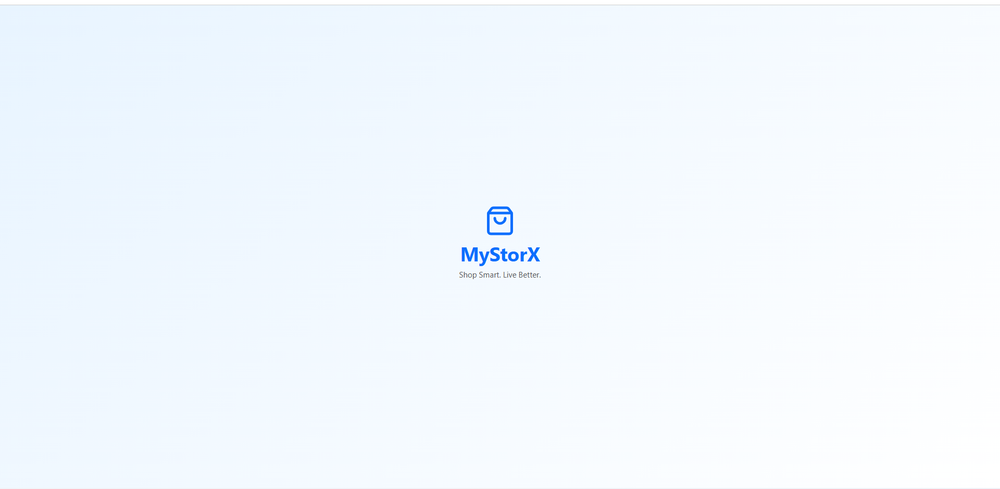

---

<!-- PRODUCTS -->
<h2 align="center">🛍️ Products</h2>

  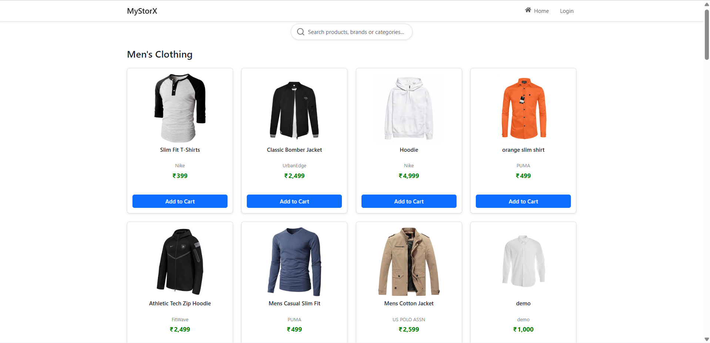
  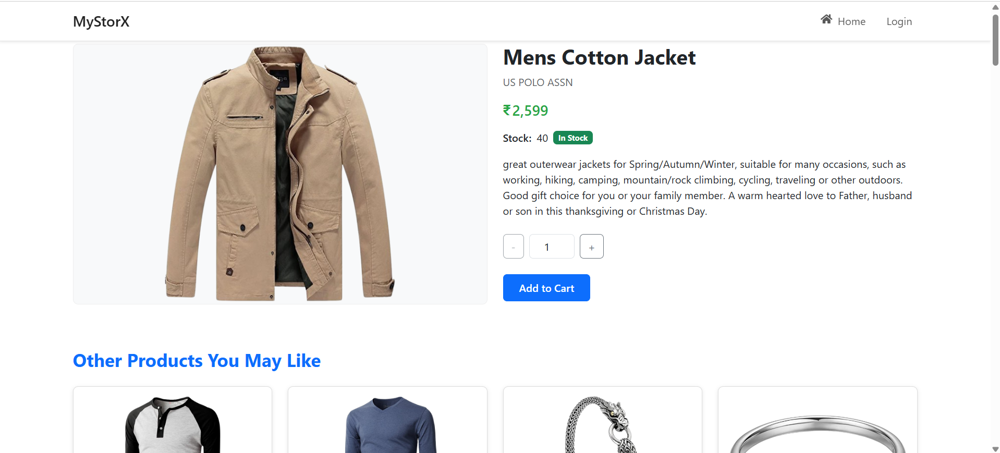

---

<!-- CART -->
<h2 align="center">🛒 Cart</h2>

  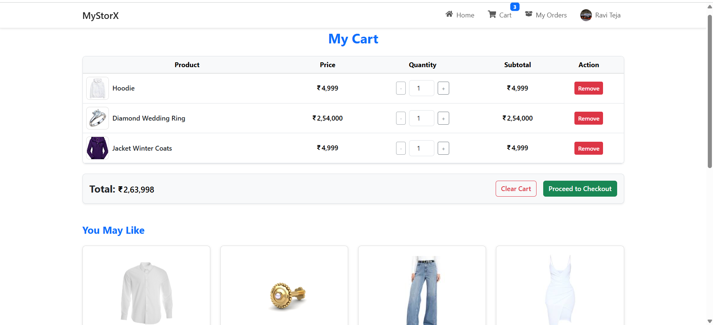

---

<!-- PAYMENTS -->
<h2 align="center">💳 Payments</h2>

  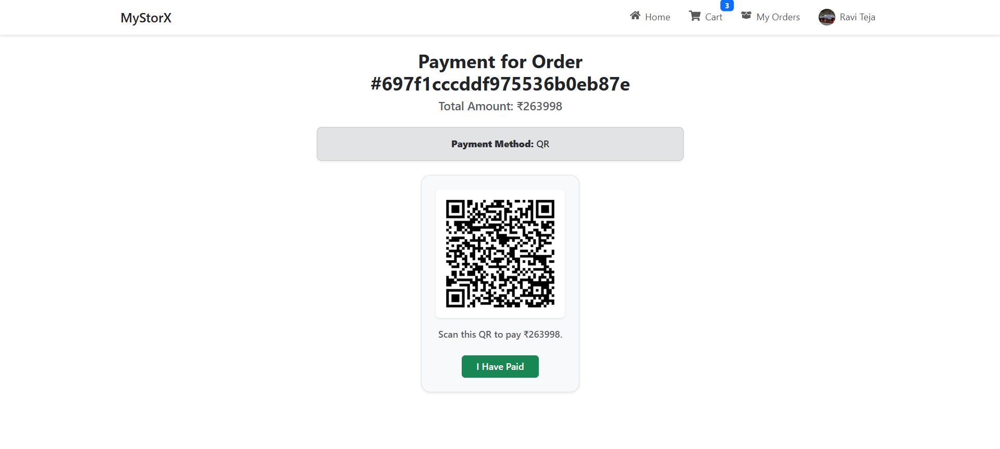

---

<!-- ORDERS -->
<h2 align="center">📦 Orders</h2>

  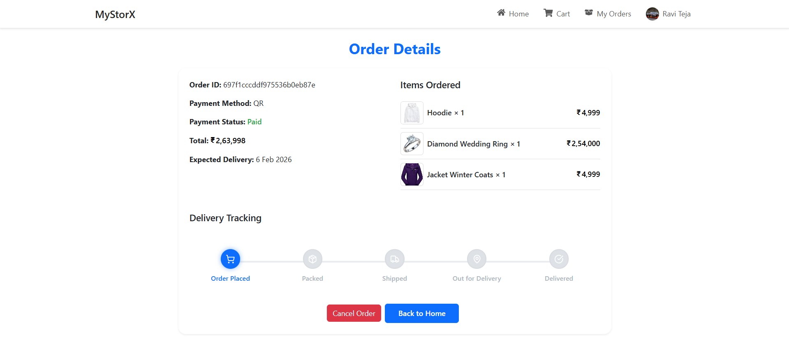
  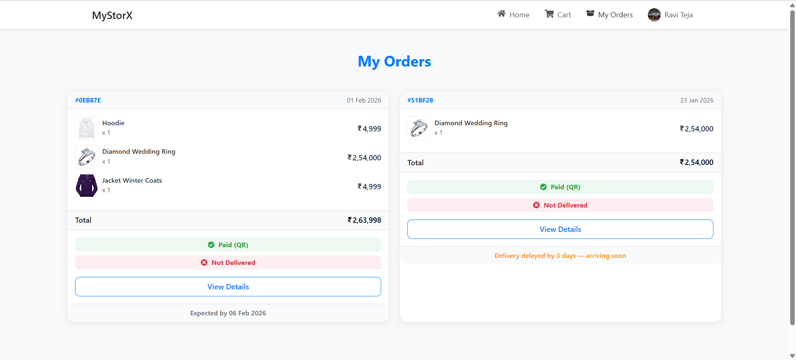

---

<!-- ADMIN -->
<h2 align="center">🛠️ Admin Dashboard</h2>

  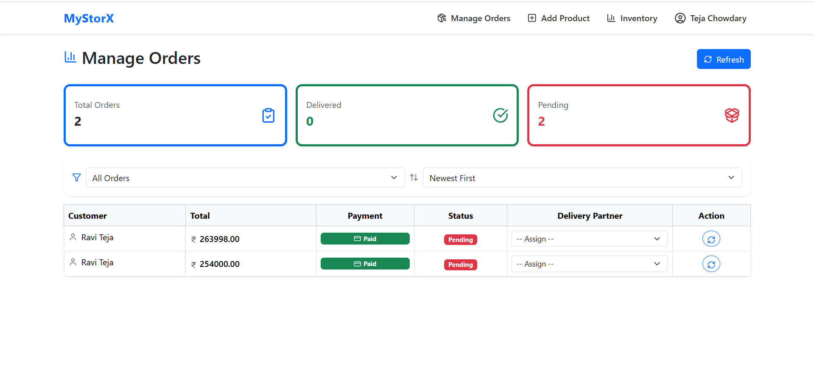
  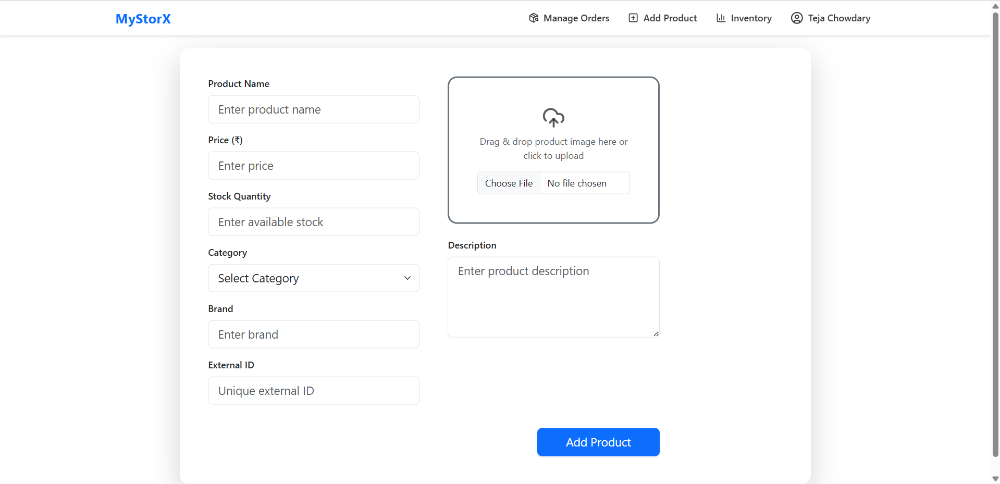
  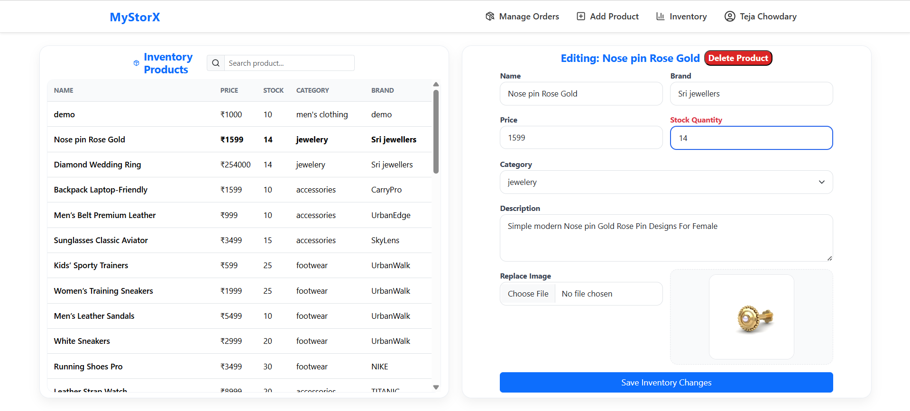

---

<!-- SUPER ADMIN -->
<h2 align="center">👑 Super Admin Analytics</h2>

  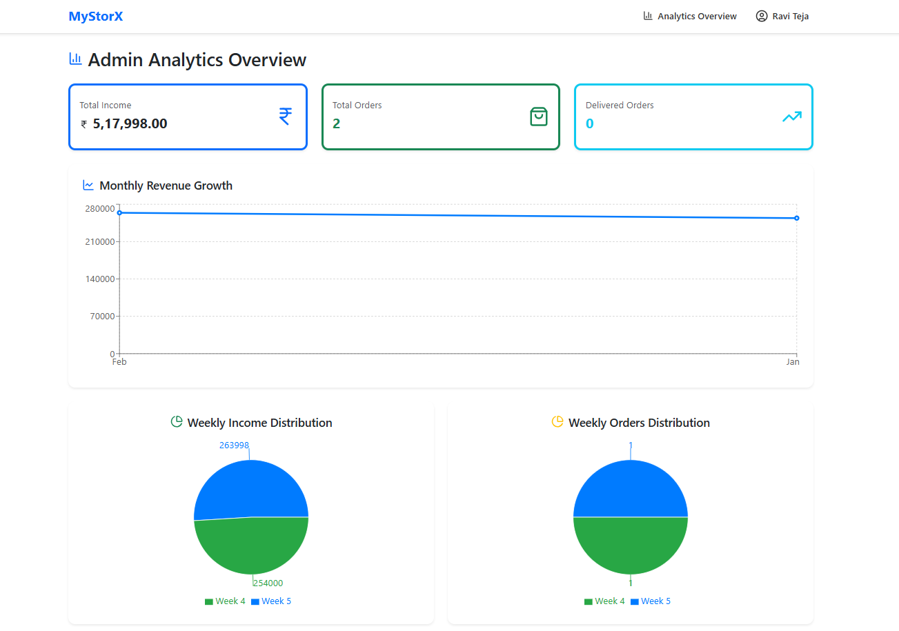

---

<!-- DELIVERY -->
<h2 align="center">🚚 Delivery Partner Dashboard</h2>

  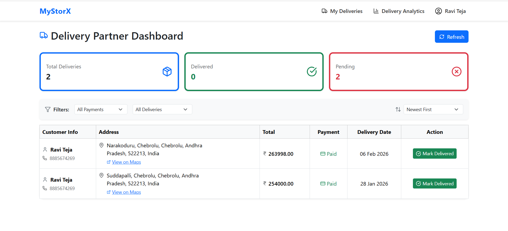
  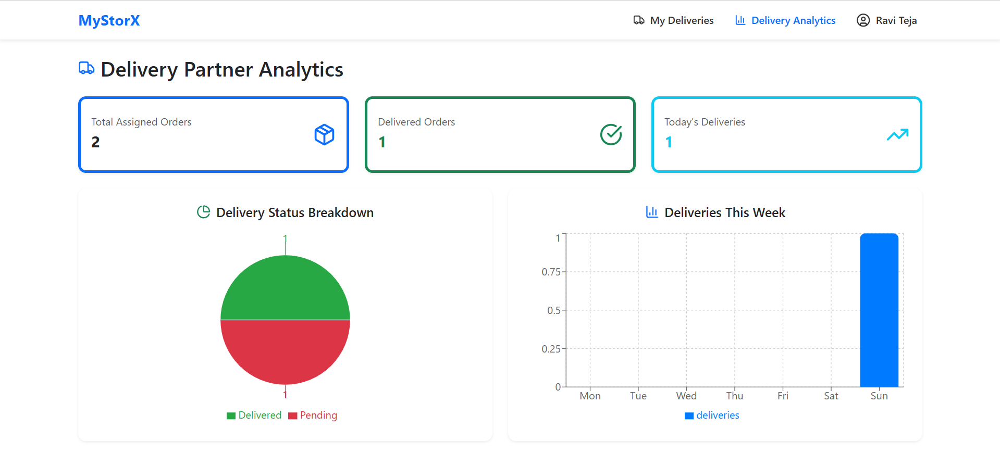

---

<h2 align="center">📬 Contact</h2>

  👨‍💻 Ravi Teja Kandula  
  📩 <a href="mailto:raviteja4880@gmail.com">raviteja4880@gmail.com</a>  
  🔗 <a href="https://github.com/raviteja4880">GitHub</a> |
  <a href="https://linkedin.com/in/ravitejakandula">LinkedIn</a>

---

## 🏁 Closing Note

**MyStoreX** combines **scalability**, **security**, and **modern UI/UX** to deliver a real-world e-commerce solution.

> A complete full-stack project demonstrating MERN expertise, role-based systems, and production-ready architecture.

  
  

